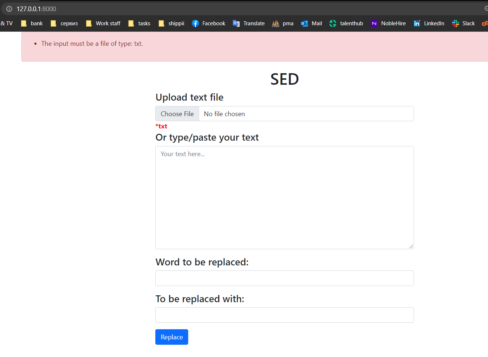

## About SED
User can upload txt file from PC or type/paste text on textarea. if the user uploads the text from the text file it's displayed on the textarea

Output is displayed on textarea, if user clicks on the text it is copied to the clipboard.

Output is saved as txt file storage/app/output.txt

Only txt file is allowed, pattern and replace fields can't be empty.

How to run it?
1. Download and install xampp https://www.apachefriends.org/download.html
2. Install Composer https://getcomposer.org/Composer-Setup.exe
3. Open Git bash or PowerShell
4. Navigate to project directory ex: cd /c//xampp/htdocs/sed
5. composer global require "laravel/installer=~1.1"
6. git clone git@github.com:sashokrist/SED.git
7. composer install
8. cp .env.example .env
9. php artisan key:generate
10. php artisan serve

Open project on localhost:8000

Run unit test:

php artisan test --testsuite=Feature

Files created:

app/Http/Controllers/SedController.php - handle all the functionality PHP

resources/views/sed.blade.php - main view HTML, JavaScript

resources/views/result.blade.php - result view HTML, JavaScript

routes/web.php - routes PHP

tests/Feature/SepTest.php - unit test PHP

Screenshots:

    

